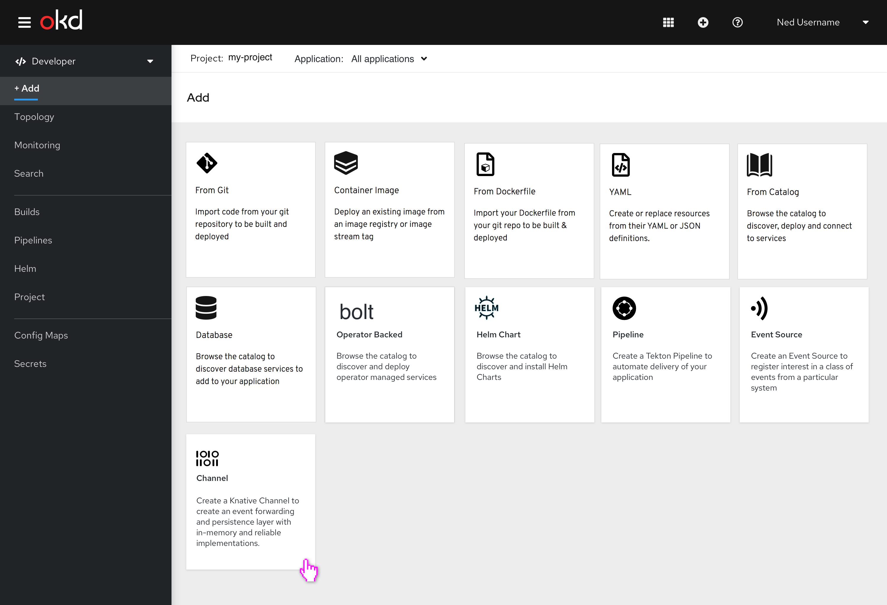
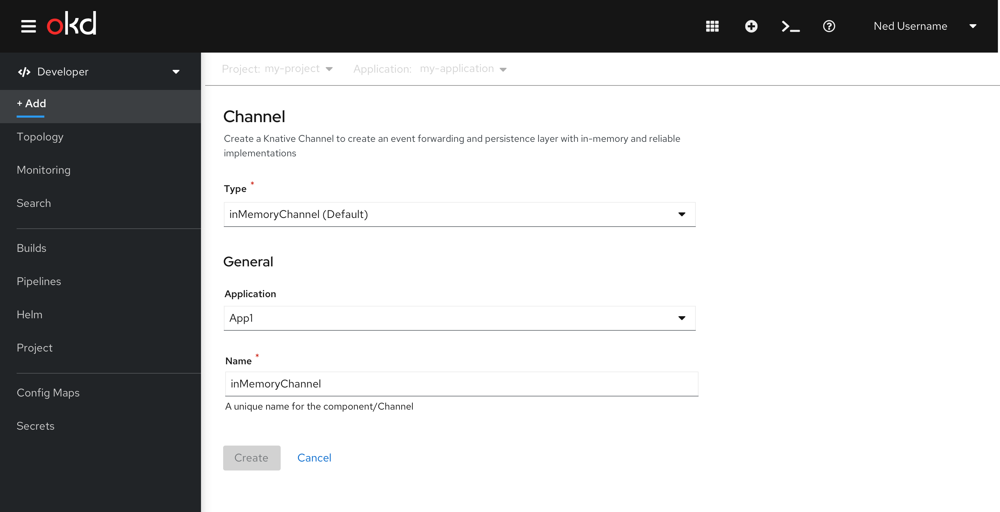
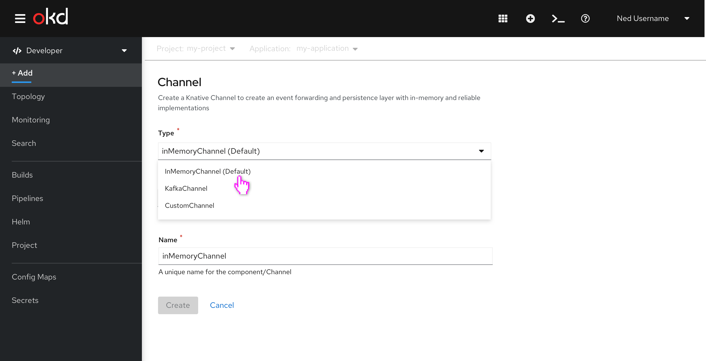
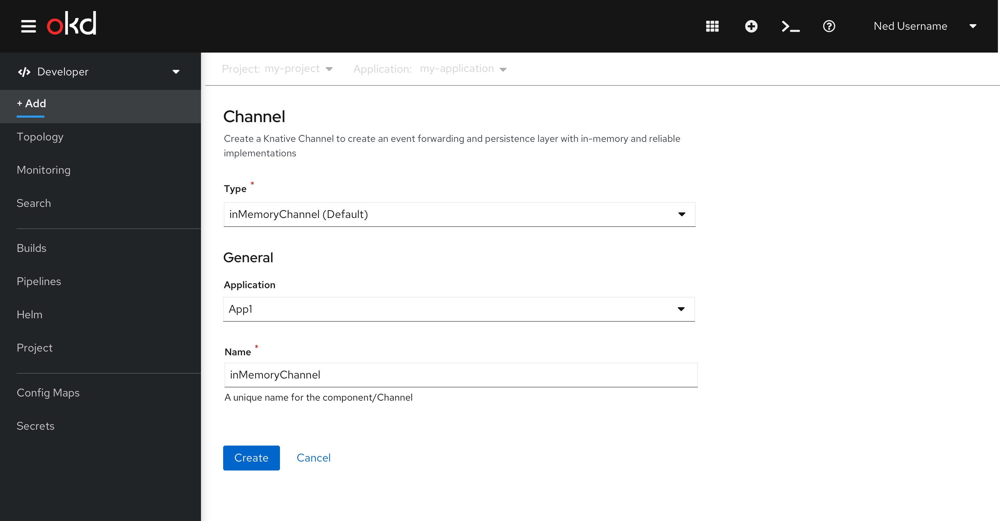
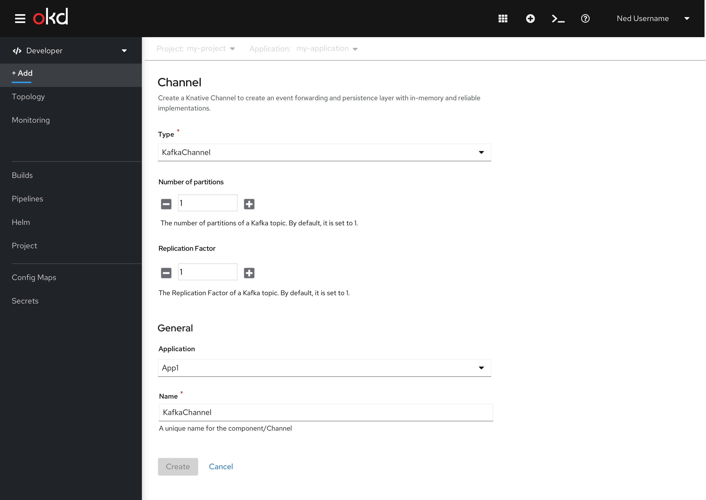
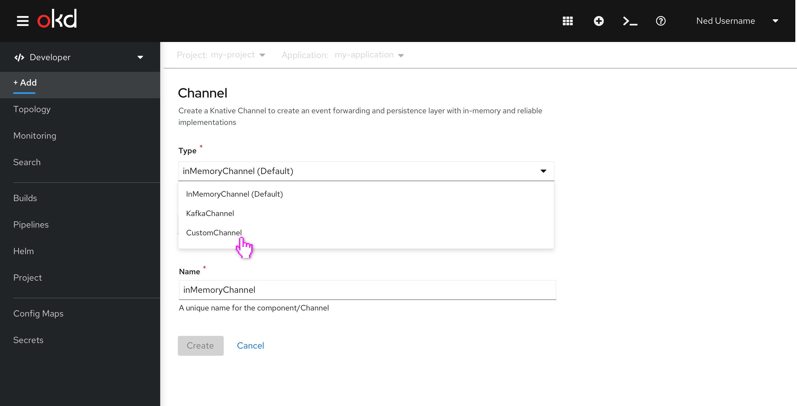
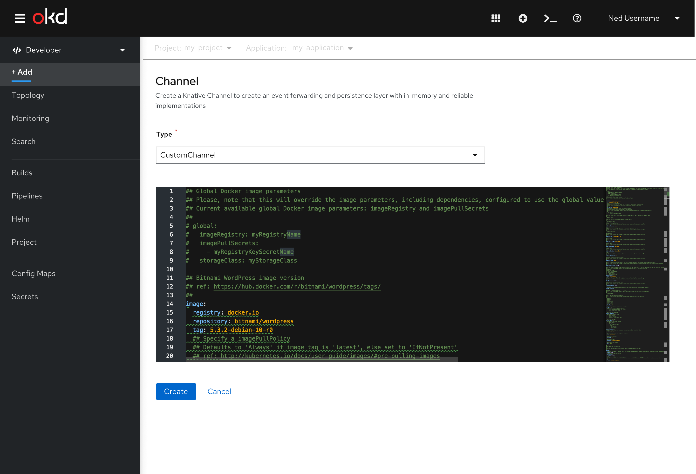
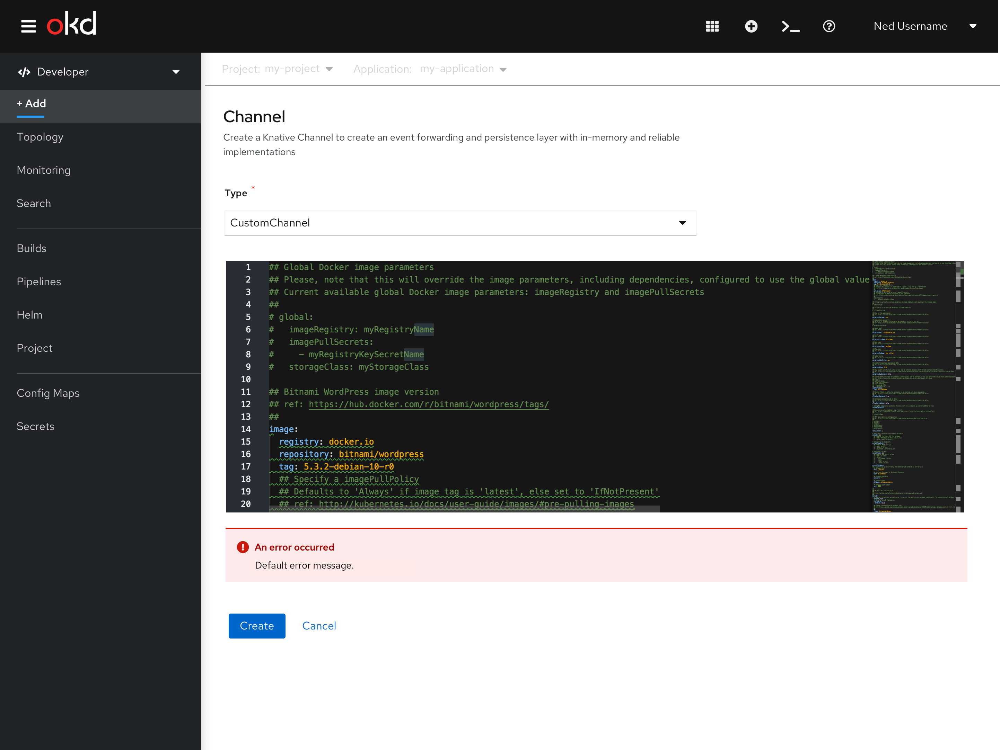
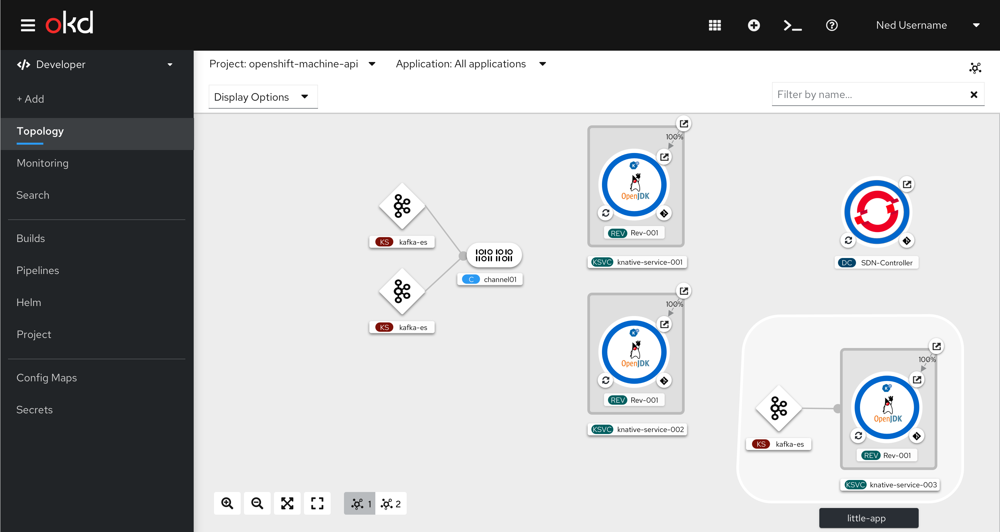

# Create a channel (4.6)
In this flow the user can create a channel. A channel can be connected to Knative services with subscriptions. Subscriptions are represented by the lines to the right of the channel.

## Select channel card
The user selects the channel card.

## Create channel path 1 - User selects IMC
Admin determines the default channel through a different workflow. In this example, the admin has selected IMC as the default channel. The default will be appended with the text “(Default)”. The name field auto-populates with the type name.

If user clicks dropdown they can still see that the Default channel is available along with the other options.

When the user completes required fields and can create their channel. When the user creates a channel, they will be brought directly to the topology view.

## Create channel path 2 - User selects KafkaChannel
New fields appear like number of partitions and replication factor.

## Create channel path 3 - User selects CustomChannel
Create a channel form. User selects CustomChannel.

User configures CustomChannel via YAML.

## Leveraging default error states
There are built-in error states for the YAML editor that we will leverage for the YAML editor when the user enters invalid YAML.

## Channel on topology view
Once the channel has been created, the user will be able to view the channel on the topology view.

